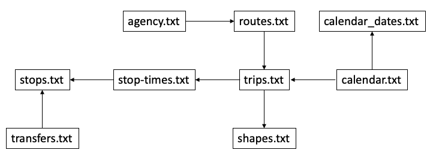
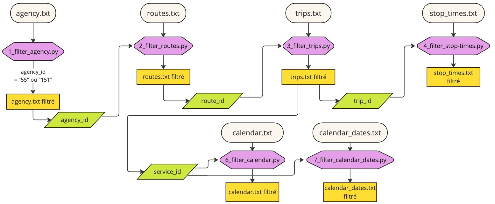

# Lausanne public transportation network

This GitHub repository presents the results of a university thesis on the Lausanne 2024 transportation network, including a sorted GTFS dataset, modeling illustrations, and identified errors, aiming to enhance transportation simulation and planning.

## Data

The data consist of 10 text files. These files collectively form a GTFS feed that was used for importing into the PTV VISSIM simulation software.

### Sources

The data were sourced from the [opentransportdata platform](https://opentransportdata.swiss/en/group), [OpenStreetMap](https://www.openstreetmap.org/), and [viageo](https://viageo.ch/).

### Organisation 

The data are structured according to the layout illustrated in the image below.

## Functionnalities

# Tools and librairies

- [Leaflet](https://leafletjs.com) to display the map and navigation functions
- [D3](https://github.com/d3/d3) to build the graph in the right sidebar 
- [www.geojson.io](www.geojson.io). to edit the geojson files

## Authors 

This project was created by Baptiste Poffet and Melinda Femminis for the course "Visualisation de données" given by Isaac Pante at UNIL. 